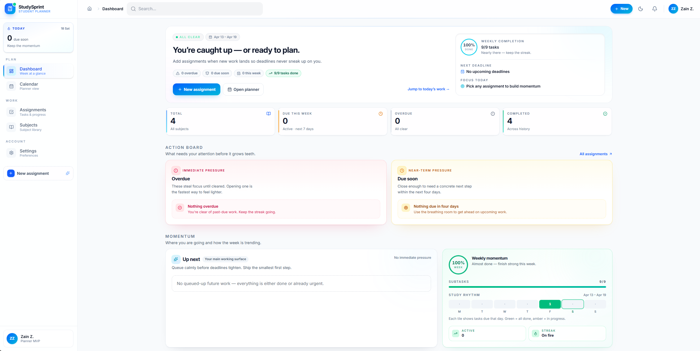
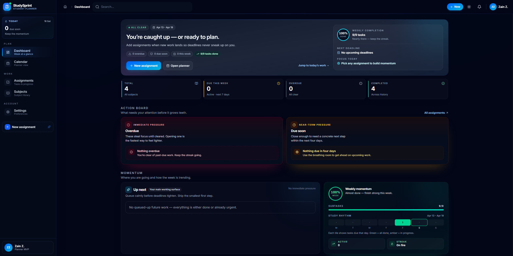
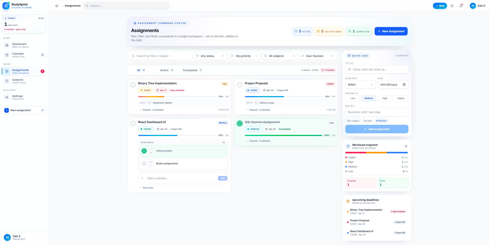
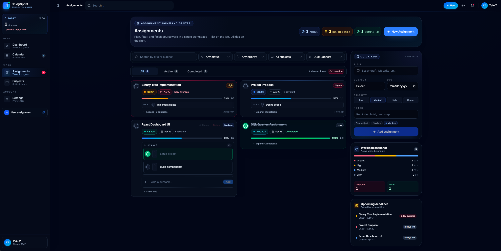
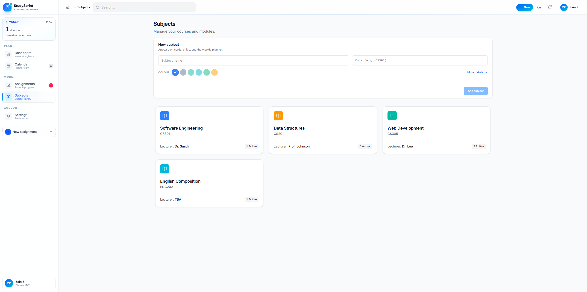
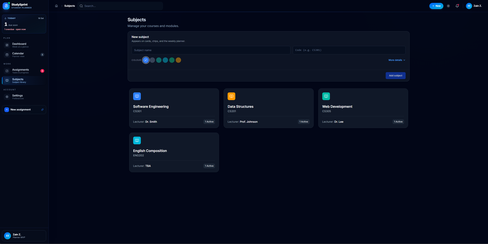
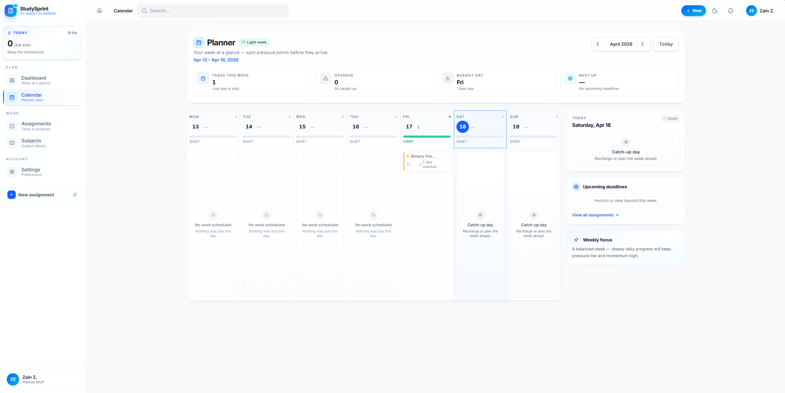

# StudySprint
https://thestudysprint.netlify.app/
> A modern, calm, and focused study planner that helps university students beat deadlines, break assignments down into achievable tasks, and stay organised across every subject — in one clean interface.

<p align="center">
  
</p>

<p align="center">
  <a href="#-the-problem">Problem</a> •
  <a href="#-the-solution">Solution</a> •
  <a href="#-features">Features</a> •
  <a href="#-screenshots">Screenshots</a> •
  <a href="#-tech-stack">Tech Stack</a> •
  <a href="#-getting-started">Getting Started</a> •
  <a href="#-roadmap">Roadmap</a>
</p>

---

## The Problem

University students juggle multiple subjects, overlapping due dates, group projects, readings, and part-time commitments — usually across a messy combination of spreadsheets, sticky notes, LMS portals, and generic to-do apps. The result:

- Deadlines get missed or noticed too late.
- Large assignments feel overwhelming because they aren't broken down.
- Students can't see their weekly workload at a glance.
- Generic productivity tools (Notion, Trello, Todoist) aren't designed for the academic cycle — subjects, priorities, and assignment progress are first-class concerns, not afterthoughts.

This creates real costs: last-minute work, lower grades, unnecessary stress, and a steady drag on student wellbeing.

## The Solution

**StudySprint** is a purpose-built *student productivity planner* that combines the best ideas from:

- **To-do lists** (capture quickly)
- **Calendar planners** (see workload by time)
- **Kanban boards** (track status)
- **Smart, priority-based reminders** (focus attention where it matters)

into a single, calm, university-appropriate experience. It's designed around one clear promise:

> *Open StudySprint and within 10 seconds you know exactly what's due, what's overdue, and what to work on next.*

The product is scoped as a realistic MVP — small enough to be maintained by a 3-person student team, polished enough to present as a credible software engineering prototype, and architected to grow into a full product with authentication and cloud sync.

---

## Features

### AI Planner — academic planning studio
- A dedicated "brief-to-plan" studio at `/ai-planner`.
- **PDF-first upload** (DOCX and pasted text also supported) with drag-and-drop, file previews, page counts, and friendly error handling for scanned PDFs.
- A **server-side AI service** processes the brief and returns a structured plan. The request layer is provider-agnostic (OpenAI wired in by default via `OPENAI_API_KEY`; drop-in support for any OpenAI-compatible endpoint) with a deterministic **on-device heuristic fallback** when no key is configured or the AI service is unreachable.
- Structured output includes:
  - a plain-language **summary** of what the task is really asking,
  - **deliverables, constraints, and required sections**,
  - **rubric signals** with detected weights and guidance,
  - a **missing / unclear** panel that surfaces what the brief doesn't state (no fabricated dates or word counts),
  - a **staged action plan** (understand → map rubric → research → outline → draft → refine → rubric self-check → submit),
  - a **pacing timeline** across Discover → Research → Draft → Refine → Polish phases between now and the due date,
  - **high-mark focus tips** tailored to the deliverable type.
- Every field is **editable and reviewable** before anything is saved. Stages toggle in and out of the plan, subtasks are editable inline, and the whole plan **converts into a real StudySprint assignment with seeded subtasks** in one click.
- A **validation layer** runs against every response (due date, word count, rubric presence, plan-deliverable alignment) and surfaces warnings in the UI so the feature never pretends to be 100% accurate.
- **Privacy & ethics**: briefs are processed securely server-side for AI-assisted planning only — not stored, not used for training. An explicit safeguard note reminds students that research, writing, argument, and final submission quality remain their responsibility.

### Dashboard
- Hero summary with live counts of due-soon, overdue, and completed work.
- Stat cards, "Needs Attention", "Due Soon", "Weekly Progress", and "Up Next" panels.
- Overdue items are visually separated from active work to reduce stress, not amplify it.

### Subject Management
- Full create / edit / delete for subjects.
- Each subject carries a name, code, colour tag, lecturer, and notes.
- Subject colour identity carries through to assignment badges and the calendar.

### Assignment Tracking
- Create assignments linked to subjects, with title, due date, priority, progress, status, and notes.
- Tabs (All / Active / Completed), search, filters (status, priority), and due-date sorting.
- Priority levels are visually distinct: **Low**, **Medium**, **High**, **Urgent**.

### Task Breakdown & Progress
- Break any assignment into subtasks and tick them off.
- Assignment progress is calculated automatically from completed subtasks.
- Status derives automatically: *Not Started → In Progress → Completed → Overdue*.

### Calendar / Weekly Planner
- Weekly planner with previous / next / "today" navigation.
- Assignments appear on their due date as clickable chips in the subject's colour.
- Designed to help students see workload across the week at a glance.

### Smart Reminders (UI-level)
- In-app reminder banners for due-soon and overdue work.
- Supportive, calm tone — no gamified noise or anxiety-inducing red walls.

### Light & Dark Mode
- Fully themed light and premium navy/indigo dark mode.
- Preference persists across sessions.

### Responsive, Mobile-first
- Desktop sidebar, mobile bottom nav, and slide-in sidebar.
- Stacked cards, thumb-friendly actions, and clean hierarchy on small screens.

### Local Persistence
- All data persists to `localStorage` so nothing is lost between visits — no backend required to try it.
- A "Reset demo data" action is available in Settings.

---

## Screenshots

### Dashboard — Light & Dark

<p align="center">
  
  
</p>

### Assignments — Light & Dark

<p align="center">
  
  
</p>

### Subjects — Light & Dark

<p align="center">
  
  
</p>

### Weekly Planner

<p align="center">
  
</p>

---

## Tech Stack

| Area | Choice |
| --- | --- |
| Framework | **React 19** + **TypeScript** |
| Build tool | **Vite 7** |
| Styling | **Tailwind CSS 4** |
| Routing | **React Router 7** |
| Icons | **lucide-react** |
| Dates | **date-fns** |
| State | React Context (`PlannerContext`, `ThemeContext`, `ToastContext`) |
| Persistence | `localStorage` (Supabase-ready architecture) |
| AI Planner (server) | Vite dev middleware → provider-agnostic AI service (`server/aiPlanner/`). OpenAI-ready via `OPENAI_API_KEY`. |
| AI Planner (client) | PDF (`pdfjs-dist`) + DOCX (`mammoth`) extraction, structured-output renderer (`src/pages/AIPlanner.tsx`) |
| Fallback engine | Deterministic on-device heuristic planner (`src/lib/briefAnalyzer.ts`) — used when no API key or the AI call fails |
| Lint / Format | ESLint 9 + typescript-eslint |

The codebase is intentionally lean: no Redux, no server framework, no premature abstraction — just a clean component-based architecture a small team can maintain.

---

## Project Structure

```
src/
├── App.tsx              # Router + providers
├── main.tsx             # Entry point
├── index.css            # Tailwind + theme tokens
├── layouts/             # DashboardLayout (sidebar, topbar, bottom nav)
├── pages/               # Landing, Dashboard, Subjects, Assignments,
│                        # AssignmentDetail, Calendar, Settings, AIPlanner
├── components/          # Reusable UI (cards, badges, modals, forms…)
├── context/             # PlannerContext, ThemeContext, ToastContext
├── lib/                 # Helpers: date/progress/priority, briefAnalyzer
│                        # briefExtract (PDF/DOCX), aiPlannerClient
└── types/               # Shared TypeScript types (inc. briefAnalysis)

server/                  # Dev-time AI Planner service (Vite plugin)
├── vitePlugin.ts        # Wires /api/ai-planner/analyze into the dev server
└── aiPlanner/
    ├── handler.ts       # Framework-agnostic POST handler
    ├── provider.ts      # AI provider abstraction (OpenAI + heuristic)
    ├── prompt.ts        # System prompt + JSON schema for structured output
    └── validate.ts      # Post-response validation layer (warnings)
```

---

## Getting Started

### Prerequisites
- **Node.js 20+** and **npm**

### Install & Run

```bash
git clone https://github.com/MrZoder/StudySprint.git
cd StudySprint
npm install
npm run dev
```

Then open [http://localhost:5173](http://localhost:5173).

### AI Planner configuration (optional)

The AI Planner works out of the box using the on-device heuristic engine. To enable the LLM-powered server-side planner, copy the `.env.example` file to `.env.local` and fill in your key:

```bash
cp .env.example .env.local
# then edit .env.local
OPENAI_API_KEY=sk-...
OPENAI_PLANNER_MODEL=gpt-4o-mini   # optional, default shown
AI_PLANNER_PROVIDER=auto            # auto | openai | heuristic
```

With a key set, the Vite dev server exposes `POST /api/ai-planner/analyze`, which parses the brief, calls OpenAI with structured outputs, and returns a validated `BriefAnalysis` payload the UI renders. Without a key, the same endpoint transparently falls back to the deterministic heuristic engine — the UI works identically either way. No secrets are bundled into the client.

Any OpenAI-compatible endpoint works — e.g. to use **Google Gemini via its OpenAI-compatibility shim**:

```bash
OPENAI_API_KEY=AIza...
OPENAI_BASE_URL=https://generativelanguage.googleapis.com/v1beta/openai/
OPENAI_PLANNER_MODEL=gemini-2.5-flash-lite
AI_PLANNER_PROVIDER=openai
```

---

## Deploying to Netlify (AI features included)

The built SPA is a static bundle, but the AI Planner needs a server to hold your API key securely. This repo ships with a ready-to-go **Netlify Function** so the whole thing — static UI + `/api/ai-planner/analyze` endpoint — deploys from a single `git push`.

**What's in the box**
- `netlify.toml` — tells Netlify to run `npm run build`, publish `dist/`, mount functions from `netlify/functions/`, and rewrite `/api/ai-planner/analyze` to the function.
- `netlify/functions/ai-planner-analyze.mts` — a thin Fetch-style wrapper around the same `handleAnalyze` used by the Vite dev middleware, so local dev and production behave identically.

**One-time setup**

1. **Connect the repo** to Netlify (`Add new site → Import an existing project` → pick this repo). Netlify auto-detects the build settings from `netlify.toml`.
2. **Add environment variables** in *Site settings → Environment variables*. These are server-only and never reach the client bundle:

| Variable | Required | Example |
| --- | --- | --- |
| `OPENAI_API_KEY` | yes (for LLM path) | `sk-...` or Gemini `AIza...` |
| `OPENAI_BASE_URL` | optional | `https://generativelanguage.googleapis.com/v1beta/openai/` |
| `OPENAI_PLANNER_MODEL` | optional | `gpt-4o-mini` or `gemini-2.5-flash-lite` |
| `AI_PLANNER_PROVIDER` | optional | `auto` (default), `openai`, or `heuristic` |

3. **Trigger a deploy** (Netlify builds automatically on push). The first build also provisions the Lambda for the function.

**Verifying it works**
- Open the deployed site and run an analysis. The header on the result page should read `Model: gpt-4o-mini` (or whichever model you set), not `On-device planner`.
- In Netlify's *Functions* tab, `ai-planner-analyze` should show invocations each time you analyse a brief.
- If you see "Using on-device fallback" in the UI, check the function logs — usually either the env var is missing or the upstream provider returned a non-2xx (e.g. Gemini free-tier quota exhaustion).

**A note on the shared key**

The configuration above uses one key for every visitor — fine for a demo or portfolio. If the app goes wider, be aware:
- Every analysis counts against *your* provider quota and billing.
- There is currently no rate-limit on the function — a scripted abuser could burn through your budget.
- If you need to productionise, add per-IP throttling inside the function, or switch to a "bring your own key" pattern where users paste their own key into Settings (kept in `localStorage`, sent with each request).

### Available Scripts

| Script | Purpose |
| --- | --- |
| `npm run dev` | Start the Vite dev server with HMR |
| `npm run build` | Type-check and produce a production build in `dist/` |
| `npm run preview` | Preview the production build locally |
| `npm run lint` | Run ESLint across the project |

---

## Stakeholder Value

StudySprint is designed with three stakeholder groups in mind:

- **Students** — deadline clarity, reduced overwhelm, simpler academic planning, better task visibility.
- **Universities** — stronger student organisation, improved time management, better academic engagement.
- **Learning Support Teams** — a lightweight tool to help at-risk students stay on track with planning and deadlines.

The product positioning is deliberately *not* a generic to-do list — it is a **smart, priority-based academic planner** with just enough calendar and dashboard workflow to feel complete.

---

## Roadmap

Current build is a polished **frontend MVP** with an on-device AI planning assist. Planned next steps:

- **Backend & Auth** — Supabase integration for user accounts and multi-device sync.
- **Optional LLM upgrade for the AI Planner** — swap the local heuristic engine for a hosted model (with a user-supplied API key) for richer briefs / PDFs.
- **PDF / DOCX ingestion** — parse uploaded assignment PDFs directly instead of requiring plain-text paste.
- **Real reminder engine** — scheduled email / push notifications, not just in-app banners.
- **Richer subtask editing** — edit text, delete, and reorder.
- **Confirmation & undo UX** — safer destructive actions with toast-based undo.
- **Richer validation** — inline validation, date rule warnings, duplicate detection.
- **Deeper planner** — monthly calendar mode, drag-to-reschedule, workload heatmap.
- **Global search** — wire the topbar search to global filtering/navigation.
- **Automated tests** — unit / integration / end-to-end coverage.

See [`ProjectStatusSummary.md`](./ProjectStatusSummary.md) for a detailed status write-up and [`Project.md`](./Project.md) for the original product brief.

---

## License

This project is released for educational and portfolio purposes. All rights reserved by the authors unless stated otherwise.

---

<p align="center">
  <strong>StudySprint</strong> — less overwhelm, more momentum.
</p>
